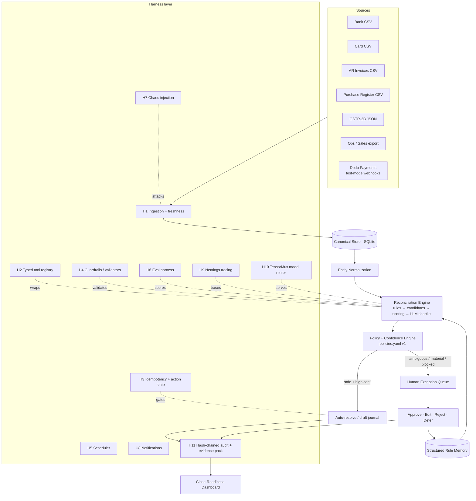

# ReconcileOS — Final Architecture

**Autonomous Finance Reconciliation & Close Agent**
**Syndicate by Maximor · Track 2 — Autonomous Office of the CFO**

**Status:** Final, build-ready. Supersedes `docs/Track-2-Original-Architecture.md` (kept for reference).

> ### Built by ~58 parallel agents under Agent Orchestrator
> Every feature in this document ships. **§17 is the task division** — each agent gets one clearly
> bounded unit of work with named deliverables and named dependencies. AO handles orchestration,
> merging, and CI.

---

## 0. What changed from the original spec, and why

The original spec (`docs/Track-2-Original-Architecture.md`) is a good *product* document but an
under-specified *engineering* document. A parallel spec (AgentLedger) proposed a TypeScript/Next.js/
Supabase stack with Supabase Auth, RBAC, Upstash Redis, and Vercel. Both are trimmed here.

### Removed — deliberately, not by accident

| Removed | Why |
|---|---|
| Login / signup / sessions | Zero judging weight. Single-operator demo app. |
| 2FA / MFA | Same. Costs hours, earns nothing. |
| Supabase Auth, RBAC, reviewer roles | Replaced by a single `actor_id` field on every audit event. Role separation is *modelled in data*, not enforced by a login wall. |
| Multi-tenancy | Single org (`abc_software`). `entity_id` exists in the schema so multi-tenancy is a later migration, not a rewrite. |
| Upstash Redis | SQLite handles idempotency keys and locks at demo scale. One less hosted dependency to fail on stage. |
| Vercel / managed hosting | We run our own server (`uvicorn`). Fully local demo = no network risk during the video. |
| Kafka / RabbitMQ / K8s / microservices | An in-process job queue backed by a SQLite `outbox` table is sufficient and is *visible* in the audit trail. |
| Vector DB / embeddings | Merchant and entity resolution is solved better and more explainably by normalization + RapidFuzz + a learned alias table. |
| Live GST portal / live bank / live ERP connectors | Adapters sit behind an interface; inputs are CSV/JSON + Dodo test-mode webhooks. |
| Full GL replacement, tax filing engine, payroll | Out of Track 2's demonstrable scope. |
| **Replay harness** | The hash-chained append-only audit log already answers "why did the system do this?" Deterministic re-execution is a production feature. |

Everything else from the original spec **ships**. See §17 for how the work divides across agents.

### Added — the harness layer

The original doc described *what the agent does*. It barely described *what the agent runs on*.
Sections 4–13 define **eleven harnesses** plus the four sponsor integrations (**AO, Neatlogs,
TensorMux, Dodo Payments**). These are where "Technical Execution & Reliability" (25%) and
"AO Usage & Build Process" (25%) — half the total score — are actually won.

---

## 1. One-paragraph product statement

Finance teams spend their month asking the same question in four costumes: *two systems describe
the same money differently — which records are the same event, and what do I do about the ones
that aren't?* ReconcileOS is one agent with one operating loop that ingests both sides, normalizes
identities, matches deterministically first and probabilistically second, auto-resolves only what
policy says is safe, escalates the rest to a human with evidence and alternatives, turns each human
decision into a scoped reusable rule, and writes a hash-chained audit event for every state change.
The output is a continuously-improving **close-readiness** number instead of a month-end fire drill.

**All four workflows are built end-to-end** (same engine, different record sets):

| # | Workflow | Set A | Set B | Question |
|---|---|---|---|---|
| 1 | Card merchant normalization | Card transactions | Merchant master + GL categories | Who is this merchant, how is it classified? |
| 2 | Cash application | Incoming bank / Dodo payments | Open AR invoices | Which invoice(s) did this cash settle? |
| 3 | Ops ↔ ERP ↔ Bank close | Ops/sales export | ERP + bank | Do the systems agree, what blocks close? |
| 4 | GST purchase reconciliation | Purchase register | GSTR-2B | Which invoices are supported / missing / mismatched? |

---

## 2. System architecture



### Stack decision

| Layer | Choice | Rationale |
|---|---|---|
| Language | **Python 3.11** | Neatlogs' primary SDK is Python; pandas/RapidFuzz/subset-sum matching is far stronger here than in TS. |
| API server | **FastAPI + uvicorn** | We run our own server. No platform lock-in, no cold starts, works offline on stage. |
| Store | **SQLite** (WAL mode) | Single file, transactional, trivially resettable between demo takes. `entity_id` present for later Postgres migration. |
| Schemas | **Pydantic v2** | Every tool input/output is a validated model — this *is* the guardrail layer. |
| Matching | pandas, RapidFuzz, bounded subset-sum | Deterministic, explainable, no vector DB. |
| Jobs | APScheduler + SQLite `outbox` table | Continuous close without infrastructure. |
| Frontend | **Vite + React + Tailwind**, 5 screens | Fast, no auth, reads the same REST API the agent writes to. |
| Inference | **TensorMux** (OpenAI-compatible) | Routing + metering, see §7. |
| Tracing | **Neatlogs** | See §6. |
| Payments feed | **Dodo Payments test mode** | See §8. |
| Dev orchestration | **AO** | See §5 and §17. Mandatory. |

**No auth of any kind.** The server binds to localhost. `actor_id` is set by a header
(`X-Actor-Id`, defaults to `finance_user_01`) purely so the audit log has an author.

---

## 3. Canonical data model

**This is the single most important artifact in the build.** Every agent codes against it, so it is
produced first (§17, Group 0) and treated as fixed thereafter. Fields marked **new** are harness additions to the original spec.

```python
FinancialTransaction:
  id, source: bank|corporate_card|payment_processor|dodo
  account_id, date, amount, currency
  counterparty_raw, reference_raw
  raw_payload: JSON                       # always kept — evidence
  source_file_id, ingested_at             # new: provenance
  external_id                             # new: Dodo payment_id, for idempotency

Invoice:
  id, invoice_number, entity_id, counterparty_id
  invoice_type: sales|purchase
  invoice_date, due_date
  taxable_amount, tax_amount, open_amount, status
  raw_payload, source_file_id

Merchant:      merchant_id, canonical_name, aliases[], default_gl_code
GSTRecord:     supplier_gstin, recipient_gstin, invoice_number, invoice_date,
               taxable_value, igst, cgst, sgst, source, raw_payload
OpsRecord:     ops_id, order_ref, date, gross_amount, fees, net_amount,
               channel, raw_payload                        # new: Workflow 3

ReconciliationCase:
  case_id, workflow, source_ids[], candidate_target_ids[]
  status: proposed|auto_resolved|queued|approved|rejected|deferred|reversed
  confidence, method, financial_impact, evidence[]
  alternatives[]                          # new: ranked runner-ups, always ≥1 when queued
  exception_type                          # new: from §9 taxonomy, nullable
  policy_version, rule_ids_used[]         # new
  neatlogs_trace_id                       # new: click-through from audit → agent reasoning
  token_cost_usd, latency_ms              # new: from TensorMux metering

HumanDecision:
  case_id, actor_id, action, final_allocations, comment, created_rule_ids[]

LearnedRule:
  rule_id, rule_type, pattern, target, scope
  source_case_id, confidence, created_at, last_used_at, use_count
  status: active|expired|disabled         # new
  never_auto: bool                        # new

AuditEvent:                               # append-only, hash-chained
  seq, timestamp, actor_type, actor_id, case_id, event_type
  before_state, after_state, inputs_hash, policy_version, model_version
  neatlogs_trace_id
  prev_hash, this_hash                    # new: tamper evidence, see §13

ActionState:                              # new: at-most-once side effects
  idempotency_key (PK), case_id, action_type, status, result, attempts

RunRecord:                                # new: run history + eval anchor
  run_id, started_at, policy_version, rule_snapshot_id,
  source_file_ids[], neatlogs_trace_id, metrics_json
```

---

## 4. The harness layer

Eleven harnesses. Each is a module under `app/harness/`, each is owned by exactly one agent (§17),
each is independently testable, and each produces something a judge can see.

### H1 — Ingestion harness
- Adapter per source; the engine never sees a raw CSV column name.
- **Column sniffing** with a per-adapter mapping file, so a slightly-different export doesn't crash the demo.
- **File fingerprinting** (`sha256`) → re-uploading the same file is a no-op, not a duplicate.
- **Freshness stamps**: every `source_file` carries `as_of`. Policy blocks auto-actions when data is stale (§10, `STALE_SOURCE_DATA`).
- Row-level rejects go to a quarantine table with the reason — never silently dropped.

### H2 — Typed tool registry
The LLM orchestrates; deterministic Python tools calculate. Every tool is a Pydantic in/out pair,
registered with a **permission tier**:

| Tier | Meaning | Examples |
|---|---|---|
| `READ` | No state change | `find_invoice_candidates`, `get_close_readiness` |
| `PROPOSE` | Writes a proposal only | `score_invoice_allocation`, `propose_journal`, `draft_vendor_email` |
| `ACT` | Real side effect — **always** idempotency-gated, and approval-gated by policy | `post_cash_allocation`, `send_vendor_email`, `close_period_task` |

Full tool list:

```
ingest_bank_statement · ingest_card_statement · ingest_open_invoices
ingest_purchase_register · ingest_gstr2b · ingest_ops_export
ingest_dodo_webhook

normalize_entity · resolve_merchant · find_customer_candidates
find_invoice_candidates · score_invoice_allocation · match_gst_invoice
match_ops_to_erp · match_erp_to_bank · detect_duplicate_transaction
compute_residual · classify_reconciliation_exception · explain_case

create_human_review · record_human_decision · create_structured_rule
propose_journal · draft_vendor_email · get_close_readiness
write_audit_event · export_evidence_pack
post_cash_allocation · send_vendor_email · close_period_task
```

Every tool invocation → one Neatlogs span + one audit event. There is no code path where the agent
does something the log doesn't know about.

### H3 — Idempotency & action-state harness
`idempotency_key = sha256(case_id | action_type | payload_digest)`. `ACT` tools check
`ActionState` first and return the prior result on replay. Kills the classic failure mode:
retry → duplicate journal posting / duplicate vendor email.

### H4 — Guardrail harness (the anti-hallucination layer)
Runs on every LLM output before it can become a proposal:
1. **Schema validation** — structured output or reject.
2. **Existence check** — every referenced `invoice_id` / `case_id` / `merchant_id` must exist in SQLite. A model-invented invoice is rejected, not surfaced.
3. **Arithmetic verifier** — Python recomputes every sum, split, and residual. The model never owns a number.
4. **Evidence completeness** — a proposal with no citable evidence rows cannot be auto-resolved.
5. **Materiality + policy check** — see §10.
6. **Failure direction:** a guardrail rejection never crashes and never silently drops a case. It downgrades the case to `queued` with `exception_type` set and logs *why*. Degradation is always toward human review.

### H5 — Scheduler harness (continuous close)
APScheduler runs the pipeline on an interval (demo: every 60s; production framing: nightly).
This is what makes "continuous close" real rather than a slide: the close-readiness number moves
on its own between demo beats.

### H6 — Evaluation harness
See §11. Golden dataset + scorecard + regression gate.

### H7 — Chaos / failure-injection harness
`--chaos` injects, on demand: a **stale GSTR-2B extract**, a **duplicated bank file**, **malformed
rows**, a **truncated invoice export**, a **500 from the LLM provider**, and a **mid-run crash**.
**Purpose:** the requirements explicitly reward "reliability beyond the happy path." This proves it
in 15 seconds of video instead of claiming it on a slide. Expected behaviour under chaos: zero
duplicate side effects, zero silent auto-resolutions, cases degrade to `queued`, audit chain intact.

### H8 — Notification harness
Sinks: console, file, Slack webhook, SMTP — all behind one interface. Vendor emails and controller
alerts are **drafted always, sent only after approval**. The demo runs console + file so nothing
leaves the machine, with the Slack sink shown as configured-but-gated.

### H9 — Observability harness → **Neatlogs** (§6)
### H10 — Model router harness → **TensorMux** (§7)
### H11 — Audit & evidence-pack harness (§13)

---

## 5. AO (Agent Orchestrator) — mandatory, 25% of score

AO is not a runtime dependency of ReconcileOS. It is the **development harness** — and with ~45
agents building this system in 10 hours, it is also the only reason the build is feasible at all.
That makes AO usage genuinely load-bearing here rather than a checkbox, which is exactly the story
the judges are looking for.

### How we use it
- **`.ao/` in the repo root, committed in the first 30 minutes**, before any feature code:
  - `.ao/orchestrator-rules.md` — task decomposition, boundary enforcement, dedup, dependency detection, evidence-before-integration, *reject fabricated eval numbers*, Track-2 scope compliance.
  - `.ao/worker-rules.md` — **file-ownership boundaries are absolute**; a worker that needs a file it doesn't own raises a dependency instead of editing it. Mandatory tests per unit. No credentials in task descriptions.
  - `.ao/tasks/` — one file per task from §17's breakdown, so the decomposition itself is in git history.
- **~45 workers in isolated worktrees, one PR each**, fanned out in waves (§17).
- **AO handles CI fixes and merge conflicts** on worker PRs — with disjoint file ownership there should be almost none, which is the whole design.
- **Orchestrator gates merges** on: tests pass, contract unchanged, eval scorecard not regressed, audit invariants hold.

### Evidence we produce for the judges
| Artifact | Where |
|---|---|
| `.ao/` rules + ~45 task files | repo root, committed first |
| `docs/AO-SESSIONS.md` — session count, task→PR→commit table, dashboard screenshots | repo |
| Commit trailer `AO-Session: <id>` on worker commits | git log |
| ~45 PRs / branches showing genuine parallel execution | GitHub |
| ~20s of the demo video showing the live AO dashboard mid-run | demo |

> **Hold the line:** if a module was written outside AO, say so. Fabricated AO evidence is a
> disqualification risk and the rules state judges may verify commit logs.

---

## 6. Neatlogs — runtime observability & failure analysis

```python
import neatlogs
neatlogs.init(api_key=os.environ["NEATLOGS_API_KEY"], tags=["reconcileos", RUN_ID])

@neatlogs.span(kind="WORKFLOW")
def run_reconciliation(period: str) -> RunResult: ...
```

`init()` is called in `app/main.py` **before** any LLM client import (auto-instrumentation patches
at import time).

### What we trace
- One **WORKFLOW** span per pipeline run, tagged `run_id`, `period`, `policy_version`.
- One **child span per tool call** (H2) with tier, inputs hash, duration, and outcome.
- One **span per LLM call**: prompt template id, model, tokens in/out, latency, retry count.
- Guardrail rejections traced as explicit **error events** with the rejected payload — so a hallucinated invoice ID is visible, not buried.

### The integration that matters
**`neatlogs_trace_id` is stored on `ReconciliationCase`, `RunRecord`, and every `AuditEvent`.**
Each case detail page has a *"View agent reasoning →"* link straight into the Neatlogs trace.
That closes the loop the judges care about: the audit trail doesn't just say *what* was decided,
it links to *the actual reasoning that produced it.*

### Failure analysis loop
Traces from the eval run (§11) are grouped by `exception_type` and failure mode in Neatlogs; the
top recurring failure becomes the next AO task. That cycle — trace → failure cluster → fix →
re-score — is the "evaluation loop demonstrating improvement" the requirements ask for, and with
this many agents we can run it more than once.

---

## 7. TensorMux — inference routing & cost metering

OpenAI-compatible endpoint, so it drops in behind one base URL:

```python
client = OpenAI(base_url=os.environ["TENSORMUX_BASE_URL"],
                api_key=os.environ["TENSORMUX_API_KEY"])
```

### Routing policy (`config/models.yaml`)

| Task | Tier | Why |
|---|---|---|
| Merchant descriptor disambiguation | small/fast model | High volume, low stakes, shortlist already constrained |
| Exception classification into §9 taxonomy | small/fast model | Closed label set |
| Cash-application shortlist selection | reasoning model | Genuinely ambiguous, materially consequential |
| Vendor-correction email drafting | reasoning model | Human-facing text |
| Close commentary from validated facts | reasoning model | Narrative over already-verified numbers |

- **Fallback chain** — if the primary model errors or times out, route to the secondary; if both fail, the case degrades to `queued`. The pipeline never dies on an LLM outage.
- **Cost metering** — per-call tokens and cost land on the case (`token_cost_usd`), aggregated into the KPI **"cost per exception resolved."** That is a real, defensible efficiency number, and it drops between Run 1 and Run 2 as learned rules displace LLM calls.
- **Deterministic-first is a cost strategy, not just an accuracy one.** The dashboard shows `% of cases resolved with zero LLM calls`.

---

## 8. Dodo Payments — a live third-party financial feed

The original spec's inputs are all CSVs. Dodo test mode gives us **one genuinely live, external,
event-driven source** — which makes the demo materially more credible and satisfies "genuine tool usage."

### Integration
- **Outbound:** a seed script creates test-mode products, customers, one-time payments, a subscription, and a refund — the kind of AR activity a SaaS company actually has.
- **Inbound:** `POST /webhooks/dodo` receives `payment.succeeded`, `payment.failed`, `refund.succeeded`, `subscription.renewed`, `dispute.opened`.
  - **HMAC-SHA256 verification** using the `webhook-id` / `webhook-timestamp` / `webhook-signature` headers. (This is *signature* verification, not user auth — it stays.)
  - Handler is **idempotent on `webhook-id`** via H3; replayed webhooks are no-ops.
- Each verified event becomes a `FinancialTransaction` with `source=dodo`, `external_id=payment_id`, and flows into **cash application (Workflow 2)** exactly like a bank line.

### Why this earns points beyond "we used a sponsor"
Payment-processor settlements produce *real* reconciliation exceptions, for free:
- **Gross vs net** — customer paid ₹30,000, payout is ₹29,115 after fees → `PROCESSOR_FEE_DIFFERENCE`, resolved with a fee explanation rather than reported as a false mismatch. Proves the agent knows *not every difference is an error*.
- **Timing** — payment succeeds on the 30th, payout lands on the 2nd → `SETTLEMENT_TIMING`, a legitimate cut-off difference the agent must *explain*, not "fix."
- **Refunds** — a refund after invoice settlement forces a `REFUND_REVERSAL` audit event, proving history is never overwritten.
- **Disputes** — `DISPUTE_HOLD` parks the receivable and blocks close, exercising the blocker path on the dashboard.

Test mode only. Live keys are never used; `.env.example` ships `DODO_MODE=test` and the server
refuses to boot in `live` mode.

---

## 9. Exception taxonomy

Explicit types make the agent testable, demoable, and gradeable.

**Card:** `UNKNOWN_MERCHANT` · `AMBIGUOUS_MERCHANT` · `CATEGORY_UNCERTAIN` · `DUPLICATE_CARD_TRANSACTION`
**Cash application:** `NO_INVOICE_MATCH` · `MULTIPLE_PLAUSIBLE_MATCHES` · `ONE_TO_MANY_PAYMENT` · `PARTIAL_PAYMENT` · `OVERPAYMENT` · `UNDERPAYMENT` · `UNKNOWN_PAYER`
**Close:** `BANK_LEDGER_DIFFERENCE` · `OPS_ERP_MISSING_RECORD` · `INTERCOMPANY_DIFFERENCE` · `ACCRUAL_REQUIRED` · `FX_REVALUATION_PENDING` · `STALE_SOURCE_DATA`
**GST:** `MISSING_IN_2B` · `MISSING_IN_ERP` · `GSTIN_MISMATCH` · `INVOICE_NUMBER_MISMATCH` · `DATE_MISMATCH` · `TAXABLE_VALUE_MISMATCH` · `TAX_AMOUNT_MISMATCH` · `DUPLICATE_INVOICE`
**Processor (from Dodo):** `PROCESSOR_FEE_DIFFERENCE` · `SETTLEMENT_TIMING` · `REFUND_REVERSAL` · `DISPUTE_HOLD`

---

## 10. Policy engine — configuration, not code

`config/policies.yaml`, versioned. The active `policy_version` is stamped on every case and audit
event so a decision can always be read against the rules that were live at the time.

```yaml
version: v1
materiality:
  auto_resolve_max_amount: 25000       # INR
  controller_approval_above: 100000
freshness:
  max_source_age_hours: 36             # else STALE_SOURCE_DATA, block auto-actions
thresholds:
  auto_resolve_min_confidence: 0.95
  queue_with_recommendation_min: 0.60
rules:
  - if: match_type == exact_invoice_reference and amount_diff == 0 and customer_unique
    then: auto_apply
  - if: workflow == gst and abs(tax_diff) > 0
    then: human_review
  - if: card_category in ["Unusual", "Restricted"]
    then: human_review
  - if: journal.is_period_closing_adjustment
    then: controller_approval
  - if: counterparty.never_auto
    then: human_review
  - if: exception_type in [DISPUTE_HOLD, INTERCOMPANY_DIFFERENCE]
    then: human_review and blocks_close
```

Decision matrix:

| Confidence / risk | Default action |
|---|---|
| High confidence, low materiality | Auto-resolve, log, no human |
| High confidence, material | Propose + require approval |
| Medium | Queue with a recommended answer + evidence |
| Low | Queue with ranked alternatives, no default selected |
| Policy-blocked | Mandatory human, regardless of confidence |

**Invariant:** confidence alone never authorizes an action. Policy always gets the last word.

---

## 11. Evaluation harness — measurable results with evidence

Submission requires "measurable results or improvements with evidence," and fabricated results are
prohibited. So the numbers come from a committed golden dataset and a reproducible command.

### Golden dataset — `evals/golden/` (400 records, ground-truth labelled)

| Bucket | Count |
|---|---|
| Clean deterministic matches | 230 |
| Merchant alias variants (incl. 3 Starbucks + 2 Uber forms) | 40 |
| 1:many cash bundles | 20 |
| Partial / over / under payments | 20 |
| Unknown payer — must stay unapplied | 10 |
| GST exact matches | 30 |
| GST mismatches (tax, taxable, number-format, missing-in-2B, duplicate) | 30 |
| Ops↔ERP↔bank differences (incl. fee + timing) | 10 |
| Processor exceptions (Dodo) | 5 |
| Duplicates / stale / malformed (chaos) | 5 |

**How the labels are produced — this is the integrity question.** `seed/generate.py` builds each
record *from* a known ground truth and emits the label alongside the data. Nothing is back-filled
from the agent's own output, which would make the scorecard circular and worthless. Before the run,
a **stratified 40-record sample is read by a human** to confirm the generator's labels are correct.
That sample check is what we claim in the README — no more, no less.

### Metrics — `python -m evals.run` → `evals/reports/scorecard.md`
1. Match accuracy = `correct / matchable`
2. Precision & recall **per exception type**
3. **Unsafe auto-resolution rate** — auto-resolved cases ground truth says were wrong. **Target: 0.** The safety metric; non-zero fails the gate.
4. Human-review rate (should be *low but non-zero* — zero means the agent is overconfident)
5. Evidence completeness = `% of decisions with ≥1 citable evidence row`
6. Hallucination rejections caught by H4 (should be >0 under chaos — it proves the guardrail fires)
7. Cost per resolved case (TensorMux) and `% resolved with zero LLM calls`
8. Mean latency per case
9. Close-readiness delta

### The learning experiment — Run 1 vs Run 2 (the headline number)
```
Run 1 (cold, no learned rules)
  400 records · 312 deterministic · 58 scored · 30 human exceptions

Human confirms 12 recurring patterns → 12 scoped rules written to memory

Run 2 (same 400 records + a fresh statement with new-but-similar descriptors)
  400 records · 347 deterministic/rule · 39 scored · 14 human exceptions

Human investigation queue reduced 53% · unsafe auto-resolutions: 0 · cost/case down 41%
```

> ⚠️ **Those numbers are the shape we expect, not results.** They are placeholders until
> `evals/run.py` produces them at T+7:00. Whatever it prints goes in the video and on Devpost, even
> if it's less flattering. Fabricated results are an explicit disqualification risk.

The second half of that line matters as much as the first: **learning must not buy accuracy with
safety.** The eval asserts both.

### Regression gate
The AO orchestrator (§5) blocks merges if unsafe-auto-resolve > 0 or if match accuracy regresses
more than 1 point against the committed baseline.

---

## 12. API + UI surface (no auth)

### REST — FastAPI, localhost

```
POST /ingest/{source}          multipart file upload
POST /webhooks/dodo            HMAC-verified processor events
POST /run                      trigger a reconciliation run  → { run_id, neatlogs_trace_id }
GET  /close-readiness?period=  dashboard payload
GET  /cases?status=&workflow=  exception queue
GET  /cases/{case_id}          evidence, alternatives, trace link, audit timeline
POST /cases/{case_id}/decision { action, allocations?, comment?, create_rule? }
GET  /rules                    learned rules
POST /rules/{id}/disable       kill a bad rule
GET  /audit?case_id=           append-only event stream
GET  /audit/verify             re-walks the hash chain → { ok, broken_at }
GET  /cases/{id}/evidence-pack ZIP export
GET  /runs · GET /runs/{id}    run history
GET  /metrics                  KPIs incl. cost/case, auto-resolve %, LLM-free %
POST /admin/reset              reload seed data (demo takes)
```

`X-Actor-Id` names the human on audit events. Absent → `finance_user_01`. That is the entire
identity story, by design.

**This contract is produced first** (§17, Group 0) so frontend and backend agents build against a
fixed interface.

### UI — 5 screens
1. **Close Readiness** — overall %, per-workflow bars, blockers, "today's high-impact actions"
2. **Exception Queue** — sortable by financial impact; each row: what the agent thinks, confidence, impact
3. **Case Detail** — evidence list, ranked alternatives, arithmetic shown, **Approve / Edit split / Reject / Leave unapplied**, "View agent reasoning →" (Neatlogs)
4. **Rules Learned** — pattern, scope, source case, use count, disable toggle
5. **Audit Timeline** — every state transition, hash-chain status badge, evidence-pack download

---

## 13. Audit, evidence, and trust (what replaces auth)

We removed the login wall, so trust has to come from the ledger instead. It does:

- **Append-only.** No UPDATE, no DELETE on `audit_events`. Corrections are new reversal events.
- **Hash-chained.** `this_hash = sha256(prev_hash | seq | payload)`. `GET /audit/verify` walks the chain and reports the first break. Tampering with history is detectable without any access control.
- **Provenance on everything.** `inputs_hash`, `source_file_id`, `policy_version`, `model_version`, `rule_ids_used`, `neatlogs_trace_id` on each case.
- **Evidence pack.** Per case: source rows (both sides), candidate set, scores, policy evaluated, human decision, resulting rule, and the trace link — a ZIP an auditor can be handed.
- **Reversibility.** Any resolved case can be reversed; the reversal is an event, the original stands.

> An auditor six months later asks *"why was this ₹30,000 allocated to these three invoices?"* and
> gets a complete answer without needing the original operator's memory. That is the actual product.

---

## 14. Failure modes and controls

| # | Risk | Control |
|---|---|---|
| 1 | Two similar merchants/vendors merged | Never auto-resolve on name similarity alone when material (H4 + policy) |
| 2 | Combinatorial explosion in cash application | Pre-filter by customer, open status, currency, date window; cap bundle size at 4; cap candidate set |
| 3 | System forces a perfect match | Residual cash / residual invoice balance are first-class; `compute_residual` is deterministic |
| 4 | One bad human approval poisons future runs | Rules are scoped, versioned, visible, use-counted, expiring, one-click disable-able |
| 5 | LLM invents a record | H4 existence check against SQLite; candidate IDs may only come from tool output |
| 6 | Stale source data | Freshness stamps + policy block → `STALE_SOURCE_DATA` |
| 7 | Tax/compliance overreach | GST module reconciles and classifies evidence; eligibility judgments stay approval-gated |
| 8 | Retry causes duplicate posting or duplicate email | H3 idempotency keys + `ActionState` + append-only audit |
| 9 | LLM provider outage mid-demo | TensorMux fallback chain; then degrade to `queued`, never crash |
| 10 | Same file uploaded twice | H1 file fingerprint → no-op |
| 11 | Guardrail rejects a valid case | Degrades to human review, never to silent auto-resolve — the failure direction is always safe |

---

## 15. Three-minute demo script

The narrative is **one hero case + one learning proof + one reliability proof.** Nothing else.

| Time | Beat | On screen |
|---|---|---|
| 0:00–0:20 | **Problem** | Close Readiness at **71%**, four workflows red, ₹4.2L of unresolved impact. *"Finance keeps comparing systems that describe the same money differently."* |
| 0:20–1:00 | **Hero case — cash application** | ₹30,000 from XYZ Retail, reference `SERVICES JUNE`. Agent proposes INV-101 + 102 + 103 at 0.87 confidence with four evidence lines and two ranked alternatives. **Approve.** Audit event appears; a bundle rule is written. |
| 1:00–1:25 | **GST exception** | INV-101: ERP ₹1,800 vs GSTR-2B ₹1,600 → `TAX_AMOUNT_MISMATCH`, 0.99. Agent drafts the vendor correction email. Human approves *sending* — showing the reasoning/action permission split. |
| 1:25–1:50 | **Learning + Dodo** | Fresh card statement with `SBX*COFFEE 0811` → auto-resolves from the rule learned earlier, **zero LLM calls**. A live Dodo test payment fires a webhook and lands in the queue mid-demo. |
| 1:50–2:15 | **Reliability** | Hit `--chaos`: re-upload a file (no-op), stale GSTR-2B (blocked, not guessed), forced LLM 500 (falls back, then queues). **Zero duplicate actions.** Then `GET /audit/verify` → chain OK. |
| 2:15–2:40 | **Measurable result + AO** | Scorecard: exception queue **−53%**, unsafe auto-resolutions **0**, cost/case **−41%**, readiness **71% → 89%**. Cut to the **AO dashboard** showing ~45 parallel workers and the session count. |
| 2:40–3:00 | **Close** | *"The human still owns judgment. The agent owns the investigation, the evidence, the memory, and the proof."* Neatlogs trace link clicked from an audit row. |

Every number spoken in the video comes from `evals/reports/scorecard.md`, which is committed and reproducible.

---

## 16. Repository layout

```
syndicateHackathon/
├── .ao/
│   ├── orchestrator-rules.md
│   ├── worker-rules.md
│   └── tasks/                  # one file per §17 task
├── app/
│   ├── main.py                 # FastAPI; neatlogs.init() first
│   ├── adapters/               # bank, card, ar, purchase, gstr2b, ops, dodo
│   ├── models/                 # Pydantic + SQLite schema
│   ├── engine/                 # normalize, merchant, cash, subsetsum, scoring,
│   │                           # gst, close, exceptions
│   ├── policy/                 # policies.yaml loader + evaluator
│   ├── memory/                 # learned rules
│   ├── harness/                # ingestion, tools, idempotency, guardrails,
│   │                           # scheduler, evals, chaos, notify,
│   │                           # tracing, modelrouter, audit
│   └── api/                    # routes
├── ui/                         # Vite + React + Tailwind, 5 screens
├── evals/
│   ├── golden/                 # labelled dataset
│   ├── run.py
│   └── reports/scorecard.md
├── seed/                       # dataset generator + Dodo test-mode seeder
├── config/                     # policies.yaml, models.yaml, adapters/*.yaml
├── docs/
│   ├── AO-SESSIONS.md
│   ├── DEMO-SCRIPT.md
│   └── Track-2-Original-Architecture.md
├── ARCHITECTURE.md
├── README.md
└── .env.example
```

### Environment

```bash
NEATLOGS_API_KEY=
TENSORMUX_BASE_URL=
TENSORMUX_API_KEY=
TENSORMUX_MODEL_FAST=
TENSORMUX_MODEL_REASONING=
DODO_API_KEY=
DODO_WEBHOOK_SECRET=
DODO_MODE=test          # server refuses to start on "live"
DB_PATH=./reconcileos.db
POLICY_VERSION=v1
```

No auth variables. There is nothing to log into.

---

## 17. Task division — ~58 agents

Every feature in this document is built. Work is divided into twelve groups. Each agent below gets
**one bounded unit of work**, the **exact files it owns**, and its **dependencies**. Groups are
listed in dependency order — Group 0 produces the interfaces everything else codes against, so it
goes first; Groups 1–7 are fully independent of each other and can all run at once.

Each task file lives in `.ao/tasks/<AGENT-ID>.md` so the decomposition itself is in git history.

---

### Group 0 — Foundation

Produces the contracts every other agent builds against.

| ID | Owns | Deliverable |
|---|---|---|
| **A00** | `.ao/`, `app/models/`, `app/db/`, `app/main.py`, `.env.example`, CI config | `.ao/orchestrator-rules.md` + `.ao/worker-rules.md`; SQLite DDL for every table in §3; Pydantic models; `AuditEvent` hash-chain writer; OpenAPI stub for every route in §12; `neatlogs.init()` at the top of `main.py`; pytest skeleton |

**Depends on:** nothing. **Everything else depends on this.**

---

### Group 1 — Source adapters (6 agents)

**Depends on:** A00 models. Each adapter maps one source format to canonical records and ships a
column-mapping config, so the engine never sees a raw CSV column name.

| ID | Owns | Deliverable |
|---|---|---|
| A01 | `app/adapters/bank.py`, `config/adapters/bank.yaml` | Bank statement CSV → `FinancialTransaction` |
| A02 | `app/adapters/card.py`, `config/adapters/card.yaml` | Corporate card CSV → `FinancialTransaction` |
| A03 | `app/adapters/ar_invoices.py`, `config/adapters/ar.yaml` | Open AR invoices CSV → `Invoice(sales)` |
| A04 | `app/adapters/purchase_register.py`, `config/adapters/purchase.yaml` | Purchase register CSV → `Invoice(purchase)` |
| A05 | `app/adapters/gstr2b.py`, `config/adapters/gstr2b.yaml` | GSTR-2B JSON/CSV → `GSTRecord` |
| A06 | `app/adapters/ops_export.py`, `config/adapters/ops.yaml` | Ops/sales export → `OpsRecord` |

---

### Group 2 — Harness layer (9 agents)

**Depends on:** A00 models. One agent per harness from §4.

| ID | Owns | Deliverable |
|---|---|---|
| A07 | `app/harness/ingestion.py` | **H1** — file fingerprinting, column sniffing, `as_of` freshness stamps, row quarantine with reasons |
| A08 | `app/harness/tools.py` | **H2** — typed tool registry, Pydantic in/out pairs, `READ` / `PROPOSE` / `ACT` permission tiers |
| A09 | `app/harness/idempotency.py` | **H3** — `idempotency_key` derivation, `ActionState` table, at-most-once `ACT` execution |
| A10 | `app/harness/guardrails.py` | **H4** — schema validation, DB existence check, arithmetic verifier, evidence-completeness check, safe downgrade to `queued` |
| A11 | `app/harness/scheduler.py` | **H5** — APScheduler continuous-close loop + SQLite `outbox` |
| A12 | `app/harness/chaos.py` | **H7** — all six injections: stale extract, duplicate file, malformed rows, truncated export, LLM 500, mid-run crash |
| A13 | `app/harness/notify.py` | **H8** — console / file / Slack webhook / SMTP sinks behind one interface, all approval-gated |
| A14 | `app/harness/audit.py` | **H11** — append-only writer, `prev_hash` / `this_hash` chaining, chain verification |
| A15 | `app/harness/evidence_pack.py` | **H11** — per-case ZIP: source rows, candidates, scores, policy evaluated, decision, resulting rule, trace link |

---

### Group 3 — Matching engine (8 agents)

**Depends on:** A00 models. The core of Workflows 1 and 2.

| ID | Owns | Deliverable |
|---|---|---|
| A16 | `app/engine/normalize.py` | Case, punctuation, store-number, corporate-suffix and location-token normalization |
| A17 | `app/engine/merchant.py` | **Workflow 1** — alias table lookup, historical confirmed mappings, RapidFuzz resolution, canonical merchant + proposed GL category |
| A18 | `app/engine/entity.py` | Customer and vendor identity resolution, alias history |
| A19 | `app/engine/cash_candidates.py` | **Workflow 2, Pass A/B** — deterministic rules, then bounded candidate generation filtered by customer, open status, currency and date window |
| A20 | `app/engine/subsetsum.py` | Capped combinatorial allocation, maximum bundle size 4 |
| A21 | `app/engine/scoring.py` | Feature weights → confidence: amount fit, identity, invoice and due dates, reference tokens, past bundle behaviour |
| A22 | `app/engine/residual.py` | Partial, over- and under-settlement; explicit residual cash and residual invoice balance |
| A23 | `app/engine/duplicates.py` | Duplicate transaction and duplicate invoice detection |

---

### Group 4 — GST reconciliation (3 agents)

**Depends on:** A00 models. **Workflow 4.**

| ID | Owns | Deliverable |
|---|---|---|
| A24 | `app/engine/gst_match.py` | GSTIN, invoice number, date and amount normalization; exact matching |
| A25 | `app/engine/gst_mismatch.py` | Fuzzy invoice-number handling (`INV-00123` vs `INV/123`) under policy; mismatch classification into the GST taxonomy |
| A26 | `app/engine/gst_vendor.py` | Exception grouping by vendor; correction-request drafting with exact invoice evidence; tracking unresolved items across filing periods |

---

### Group 5 — Close reconciliation (3 agents)

**Depends on:** A00 models. **Workflow 3, fully built.**

| ID | Owns | Deliverable |
|---|---|---|
| A27 | `app/engine/close_ops_erp.py` | Ops ↔ ERP matching, missing-record detection |
| A28 | `app/engine/close_bank.py` | ERP ↔ bank reconciliation, fee and timing difference explanation |
| A29 | `app/engine/close_advanced.py` | Intercompany differences, accrual-required cases, FX revaluation pending |

---

### Group 6 — Policy, memory, explanation (4 agents)

**Depends on:** A00 models.

| ID | Owns | Deliverable |
|---|---|---|
| A30 | `app/policy/engine.py`, `config/policies.yaml` | Versioned policy evaluation: materiality, freshness, thresholds, never-auto, controller approval, blocks-close |
| A31 | `app/memory/rules.py` | Learned rule store: type, pattern, scope, source case, confidence, use count, expiry, disable |
| A32 | `app/engine/exceptions.py` | Full §9 taxonomy plus classifier, across all four workflows |
| A33 | `app/engine/explain.py` | Evidence assembly and ranked-alternatives generation for every case |

---

### Group 7 — Close readiness (1 agent)

**Depends on:** A00 models.

| ID | Owns | Deliverable |
|---|---|---|
| A34 | `app/engine/close_readiness.py` | Per-workflow resolution percentages, blockers, overall readiness score, today's high-impact actions |

---

### Group 8 — Pipeline, API and UI (10 agents)

**Depends on:** A00 contract. The frozen API contract from §12 lets the UI agents build against a
mock, so they never wait on the backend agents.

| ID | Owns | Deliverable |
|---|---|---|
| **A35** | `app/pipeline.py` | **Orchestration** — ingest → normalize → match → policy → case → audit. The central integrating task |
| A36 | `app/api/core.py` | `POST /ingest/{source}`, `POST /run`, `GET /metrics`, `POST /admin/reset` |
| A37 | `app/api/cases.py` | `GET /cases`, `GET /cases/{id}`, `POST /cases/{id}/decision` |
| A38 | `app/api/rules.py` | `GET /rules`, `POST /rules/{id}/disable` |
| A39 | `app/api/audit.py` | `GET /audit`, `GET /audit/verify`, `GET /cases/{id}/evidence-pack`, `GET /runs` |
| A40 | `ui/src/screens/CloseReadiness.tsx` | **Screen 1** — overall %, per-workflow bars, blockers, high-impact actions |
| A41 | `ui/src/screens/ExceptionQueue.tsx` | **Screen 2** — sortable by financial impact; agent's view, confidence and impact per row |
| A42 | `ui/src/screens/CaseDetail.tsx` | **Screen 3** — evidence, ranked alternatives, arithmetic shown, Approve / Edit split / Reject / Leave unapplied, "View agent reasoning →" |
| A43 | `ui/src/screens/RulesLearned.tsx` | **Screen 4** — pattern, scope, source case, use count, disable toggle |
| A44 | `ui/src/screens/AuditTimeline.tsx` | **Screen 5** — every state transition, hash-chain status badge, evidence-pack download |

---

### Group 9 — Sponsor integrations (5 agents)

**Depends on:** A00 models; A08 tool registry for span wrapping.

| ID | Owns | Deliverable |
|---|---|---|
| A45 | `app/integrations/neatlogs.py` | **§6** — WORKFLOW span per run, child span per tool call, span per LLM call, guardrail rejections as error events, `neatlogs_trace_id` propagated onto cases, runs and audit events |
| A46 | `app/integrations/tensormux.py`, `config/models.yaml` | **§7** — OpenAI-compatible client, fast/reasoning routing table, fallback chain, degrade-to-`queued`, per-call token and cost metering onto the case |
| A47 | `app/integrations/dodo_client.py`, `seed/dodo_seed.py` | **§8** — test-mode products, customers, one-time payments, subscription, refund |
| A48 | `app/api/webhooks_dodo.py` | HMAC-SHA256 verification on `webhook-id` / `webhook-timestamp` / `webhook-signature`; idempotent handler; events → `FinancialTransaction(source=dodo)` |
| A49 | `app/engine/processor_exceptions.py` | `PROCESSOR_FEE_DIFFERENCE`, `SETTLEMENT_TIMING`, `REFUND_REVERSAL`, `DISPUTE_HOLD` |

---

### Group 10 — Data and evaluation (4 agents)

**Depends on:** A00 models; A30 policy for the safety metric.

| ID | Owns | Deliverable |
|---|---|---|
| A50 | `seed/generate.py` | 400-record golden dataset per the §11 table, **built from known ground truth with labels emitted alongside the data** |
| A51 | `evals/run.py` | All nine metrics from §11, including unsafe-auto-resolution rate and the Run 1 vs Run 2 learning comparison |
| A52 | `evals/report.py` | `evals/reports/scorecard.md` renderer |
| A53 | `evals/verify_labels.py` | Stratified 40-record label audit, so ground truth is checked rather than assumed |

---

### Group 11 — QA and submission artifacts (4 agents)

**Depends on:** merged output of the groups above.

| ID | Owns | Deliverable |
|---|---|---|
| A54 | `tests/e2e/` | Full run green, chaos suite green, audit chain verified, zero duplicate side effects on retry |
| A55 | `seed/demo_dataset.py`, `docs/DEMO-SCRIPT.md` | The exact §15 cases present and visually clean: the INR 30,000 XYZ Retail bundle, the INV-101 GST mismatch, `SBX*COFFEE 0811` |
| A56 | `README.md` | Problem statement, architecture summary, setup instructions, how to run the evals |
| A57 | `docs/AO-SESSIONS.md` | Session count, task → PR → commit table, AO dashboard screenshots |

---

### Agent count by group

| Group | Agents |
|---|---:|
| 0 · Foundation | 1 |
| 1 · Source adapters | 6 |
| 2 · Harness layer | 9 |
| 3 · Matching engine | 8 |
| 4 · GST reconciliation | 3 |
| 5 · Close reconciliation | 3 |
| 6 · Policy, memory, explanation | 4 |
| 7 · Close readiness | 1 |
| 8 · Pipeline, API and UI | 10 |
| 9 · Sponsor integrations | 5 |
| 10 · Data and evaluation | 4 |
| 11 · QA and submission | 4 |
| **Total** | **58** |

---

### Standing instructions for every worker agent

1. You own the files listed in your row. Raise a dependency rather than editing outside them.
2. The data model (§3) and the API contract (§12) come from A00. Code against them.
3. Ship unit tests with your module. A PR without tests does not merge.
4. Never fabricate an eval number, a metric, or a test result.
5. No credentials in code, task descriptions, or commit messages.
6. One module, one PR, one concern.

---

## 18. How this maps to the judging rubric

| Criterion | Weight | Where it's earned |
|---|---|---|
| **AO Usage & Build Process** | 25% | §5 + §17 — `.ao/` rules committed first, ~45 parallel worktree PRs, `AO-SESSIONS.md`, commit trailers, AO dashboard on camera. AO isn't decoration here; a 10-hour build of this size is only possible because of it |
| **Technical Execution & Reliability** | 25% | §4 harnesses, §11 eval gate with unsafe-auto-resolve = 0, §13 hash-chained audit, §14 controls, chaos demo |
| **Track Fit & Real-World Value** | 25% | Four genuine Office-of-the-CFO workflows, full exception taxonomy, human review gates, evidence packs, close readiness |
| **Demo & Usability** | 15% | §15 — one hero case, one learning proof, one reliability proof, in 3 minutes |
| **Innovation** | 10% | Reconciliation as a reusable operating layer; audit events that link to the agent's own reasoning trace; learning measured against a safety metric, not just an accuracy one |

---

## 19. Scope discipline

**Must ship:** canonical store · card normalization · cash matching incl. 1:many · GST reconciliation ·
Ops↔ERP↔Bank close matching · exception queue · confidence + evidence · approve/edit/reject/defer ·
rule memory · hash-chained audit · evidence packs · close-readiness dashboard · chaos ·
Neatlogs · TensorMux · Dodo webhooks · eval scorecard · AO evidence

**Stretch:** real vendor email send · live ERP/bank connectors · richer FX depth ·
automatic journal generation · remittance PDF extraction · second failure-analysis→fix→re-score cycle

**Do not build:** authentication of any kind · 2FA · RBAC · multi-tenancy · replay harness · general-ledger
replacement · tax filing engine · payroll · a generic autonomous-CFO chatbot · UI polish beyond legibility

> **The standing rule:** if a feature cannot appear in the 3-minute video *or* in
> `evals/reports/scorecard.md`, it does not get built during the hackathon.

---

*One agent. One loop. Resolve what is certain, escalate what is not, remember the judgment, prove what happened.*
