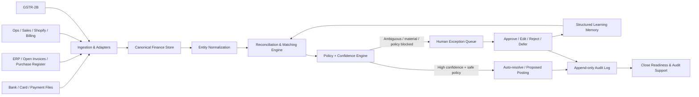

# Autonomous Finance Reconciliation & Close Agent

**Track 2 - Autonomous Office of the CFO**  
**Final architecture and product specification**  
**Status:** Hackathon-ready design; implementation details are intentionally swappable.

---

## 1. Executive Summary

The product is a **single Finance Reconciliation & Close Agent** that continuously reconciles financial activity across the systems a finance team already uses.

It is designed around one repeated Office-of-the-CFO pattern:

> **Two or more systems describe the same financial reality differently. A human has to normalize the data, match the records, investigate exceptions, decide what is correct, and leave evidence that can survive audit.**

The agent handles four concrete workflows:

1. **Corporate card merchant normalization and categorization** - messy card statement descriptions such as `STARBUCKS #1234`, `SBX*COFFEE 0042`, and `STARBUCKS STORE 0042` should resolve to the same merchant.
2. **Cash application / payment-to-invoice matching** - a bank payment may contain a weak reference, may pay several invoices at once, or may only partially settle an invoice.
3. **Month-end reconciliation and close readiness** - sales/operations, ERP/accounting, and bank records need to tell the same financial story before the books can be closed.
4. **GST purchase-register vs GSTR-2B reconciliation** - purchase invoices in the company ERP must be matched against supplier-reported invoices in GSTR-2B so finance can identify missing or incorrect input-tax-credit support and chase the right vendor.

These are not four unrelated agents. They share the same core operating loop:

```text
Ingest -> Normalize -> Match -> Score -> Explain ->
Auto-resolve safe cases -> Escalate exceptions -> Human decision ->
Post/record action -> Learn structured rule -> Audit trail -> Next run improves
```

The human is kept in control of material or ambiguous decisions. The agent should **reduce detective work**, not hide judgment behind a black box.

---

## 2. Why This Fits Track 2

Track 2 rewards a solution that demonstrates deep understanding of an actual Office-of-the-CFO workflow, including exceptions and human judgment.

This design is deliberately not a generic "AI CFO chatbot." It operates on finance records, produces evidence-backed reconciliation decisions, handles realistic exceptions, and maintains an audit trail.

### What the judges should be able to see

- **Genuine finance pain:** dirty transaction descriptions, unapplied cash, mismatched invoices, stale close data, and tax-reconciliation exceptions.
- **Real workflow depth:** 1:1, 1:many, partial, missing-record, amount-mismatch, and identity-resolution cases.
- **Human judgment:** clear approval points for ambiguous or high-risk cases.
- **Explainability:** every proposed match carries the evidence used to make it.
- **Operational realism:** the system can stop at a proposed accounting action rather than pretending every decision should be automatically posted.
- **Auditability:** an accountant should be able to reconstruct what happened months later.
- **Continuous improvement:** confirmed corrections become scoped structured rules for later runs.

---

## 3. Core Product Thesis

Most finance reconciliation work can be expressed as:

```text
Internal record set A
        +
External/internal record set B
        +
Business context and policy
        |
        v
Normalize identities and fields
        |
        v
Generate candidate matches
        |
        v
Apply deterministic rules
        |
        v
Score ambiguous candidates
        |
        v
Resolve safe cases / escalate exceptions
        |
        v
Human confirms, edits, rejects, or defers
        |
        v
Write audit event + structured memory
```

The **matching data changes by workflow**, but the reconciliation engine remains the same.

Examples:

| Workflow | Record set A | Record set B | Main question |
|---|---|---|---|
| Card statement | Bank/card transactions | Merchant master + ledger categories | "Who is this merchant and how should this spend be classified?" |
| Cash application | Incoming bank payments | Open customer invoices | "Which invoice or invoice set did this payment settle?" |
| Month-end close | Operational/sales records | ERP + bank + close schedules | "Do the systems agree, and what is preventing close?" |
| GST reconciliation | Purchase register | GSTR-2B | "Which purchase invoices are supported, missing, or mismatched?" |

---

# 4. Scenario 1 - Card Statement Merchant Normalization

## 4.1 Context

A finance manager downloads a corporate-card statement containing tens of thousands of rows. The same merchant may appear under many different bank descriptors.

Example raw descriptions:

```text
STARBUCKS #1234
STARBUCKS STORE 0042
SBX*COFFEE 0042
STARBUCKS BLR AIRPORT
```

A spreadsheet sees four strings. A human recognizes that they may all refer to the same merchant family.

## 4.2 Current human workflow

1. Download card transactions from the bank/card provider.
2. Open the file in Excel.
3. Read the merchant description row by row.
4. Decide the canonical merchant.
5. Decide the accounting category/cost center if needed.
6. Compare the results to the ledger or expense system.
7. Fix uncategorized or incorrectly categorized transactions.
8. Repeat the same recognition work next month when similar descriptors appear again.

## 4.3 Where it breaks

- Merchant descriptions are noisy and inconsistent.
- Exact string matching fails.
- Human knowledge is trapped in someone's head.
- The same correction is repeated every month.
- Large files make manual review expensive.
- A wrong categorization can propagate into management reporting or close work.

## 4.4 Agent behavior

The agent should:

1. Normalize text: case, punctuation, store numbers, corporate suffixes, location tokens.
2. Search a merchant alias table.
3. Compare against historical confirmed mappings.
4. Use fuzzy/entity similarity for unresolved descriptions.
5. Produce a canonical merchant ID and proposed category.
6. Auto-apply only high-confidence mappings.
7. Send ambiguous cases to a human with alternatives and evidence.
8. Convert the confirmed correction into a reusable scoped rule.

### Example

```text
Raw transaction: "SBX*COFFEE 0042"
Amount: INR 485

Agent proposal:
Canonical merchant: Starbucks
Category: Meals / Employee Expense
Confidence: 0.96
Evidence:
- "SBX*COFFEE" matched a previously confirmed Starbucks alias
- Store-number suffix ignored by merchant-normalization rule
- 17 prior transactions with the same prefix were confirmed as Starbucks
```

## 4.5 Human judgment

Human review is required when:

- two merchants share similar names;
- a description is too generic;
- a new merchant has no history;
- accounting category depends on business purpose rather than merchant identity;
- the amount or cost center triggers an approval policy.

The human should see **a proposed answer**, not be forced to re-investigate the entire row.

---

# 5. Scenario 2 - Payment-to-Invoice Matching / Cash Application

## 5.1 The parties involved

Use a simple example:

- **ABC Software** - seller/service provider. It performed work and issued invoices.
- **XYZ Retail** - customer. It owes ABC Software money.
- **XYZ Retail's bank** - sends the customer's payment.
- **ABC Software's bank** - receives the cash.
- **ABC Software finance team** - must decide which open invoices the cash settles.

The bank moves money. It usually does **not** understand the invoice relationship unless the payer includes a useful remittance reference.

## 5.2 Detailed example

ABC Software issued three invoices to XYZ Retail:

| Invoice | Reason | Amount |
|---|---|---:|
| INV-101 | Development work | INR 12,000 |
| INV-102 | Support | INR 10,000 |
| INV-103 | Hosting | INR 8,000 |

Total open receivable = **INR 30,000**.

XYZ Retail makes **one bank transfer of INR 30,000**.

The bank statement says:

```text
Date: 03-Sep-2026
Amount: INR 30,000
Counterparty: XYZ RETAIL PVT LTD
Reference: SERVICES JUNE
```

The statement does not explicitly say `INV-101 + INV-102 + INV-103`.

## 5.3 Current human workflow

1. Download bank statement.
2. Open the accounts-receivable/open-invoice report.
3. Find likely customer matches.
4. Search open invoice amounts.
5. Try combinations that equal the payment.
6. Inspect date, customer name, remittance reference, email, and past behavior.
7. Apply the cash to one or more invoices.
8. If uncertain, leave it as **unapplied cash / suspense** and investigate later.
9. Alternatively, a rushed person may force an incorrect allocation merely to clear the reconciliation.

## 5.4 What happens if the human cannot match it

A correct finance process should not invent certainty.

Possible outcome:

```text
Cash received: INR 30,000
Invoice allocation: Unknown
Accounting state: Unapplied cash / suspense
```

Consequences:

- the bank balance may be correct while accounts receivable is wrong;
- invoices may continue to appear unpaid even though the customer paid;
- collections teams may chase a customer incorrectly;
- mismatches may surface much later during customer disputes or audit;
- leadership sees stale or misleading receivables aging.

## 5.5 Agent behavior

The agent uses multiple passes.

### Pass A - deterministic

- exact invoice ID in bank reference;
- exact amount + unique customer;
- confirmed customer alias;
- previously confirmed remittance rule.

### Pass B - candidate combinations

For the remaining payment, generate plausible allocations such as:

```text
Candidate A: INV-101 + INV-102 + INV-103 = 30,000
Candidate B: INV-104 = 30,000
Candidate C: INV-099 + INV-103 = 29,950
```

Rank candidates using:

- amount fit;
- customer/counterparty identity;
- invoice date and due date;
- reference tokens;
- past bundle behavior;
- known partial-payment behavior.

### Pass C - model assist, only if needed

An LLM may interpret ambiguous free text or select among an already constrained candidate set. It must **never invent an invoice** that is not present in the accounting system.

## 5.6 Human judgment

For an ambiguous payment, the UI should show:

```text
Payment: INR 30,000 from XYZ Retail
Reference: SERVICES JUNE

Recommended allocation:
INV-101  INR 12,000
INV-102  INR 10,000
INV-103  INR  8,000

Confidence: 0.87
Evidence:
- All invoices belong to XYZ Retail
- Exact total amount match
- All three were open before payment date
- XYZ Retail used bundled monthly payments in 4 of the last 5 confirmed cases

[Approve] [Edit split] [Reject] [Leave unapplied]
```

After approval, the bundle pattern can become memory for the next run.

---

# 6. Scenario 3 - Month-End Reconciliation and Close

## 6.1 What "closing the books" means

"The books" means the company's accounting records - the ledger containing the month's financial activity.

Closing the books means finance has sufficiently validated and finalized the period so that management reporting, audit work, and the next accounting period can rely on it.

It is not simply pressing a "close" button. Finance has to prove that the different systems tell a consistent story.

## 6.2 The three-system picture

A simple business often has three different views of reality:

1. **Operations / sales system** - says the business activity happened.
2. **ERP / accounting system** - says how that activity was financially recorded.
3. **Bank/payment system** - says whether cash actually moved.

### Retail example

Suppose a retailer uses Shopify.

```text
Shopify:
"Customer ordered two T-shirts for INR 2,000."

ERP/accounting:
"A sale/invoice/receipt of INR 2,000 has been recorded."

Bank/payment provider:
"The corresponding cash/payout has arrived, net of any expected fees/timing differences."
```

Month-end finance asks whether these records can be reconciled and whether any difference has a valid explanation.

**Important:** the numbers do not always have to be literally identical. Timing, fees, taxes, refunds, credit terms, and unsettled receivables can create legitimate differences. The requirement is an explainable, supported chain.

## 6.3 Typical close tasks

A close calendar may include:

### Bank reconciliation

Does the accounting cash balance agree with bank activity after known timing differences?

### FX revaluation

If the business has foreign-currency receivables, payables, or cash, does finance need to record the effect of exchange-rate changes?

### Intercompany reconciliation

If Subsidiary A says it owes Subsidiary B INR 10 lakh, does Subsidiary B also show a corresponding receivable? Differences must be investigated.

### Accruals

An expense may belong to September even if the vendor invoice or cash payment arrives in October. Finance records the economic event in the correct period.

### Balance-sheet reconciliation

Material balance-sheet accounts should have support explaining why the recorded balance exists.

### Trial balance / reporting

After adjustments, the ledger should produce a stable trial balance that can feed management reporting and variance analysis.

## 6.4 Where the process breaks

- different systems export different schemas;
- people copy/paste data between spreadsheets;
- work is serial and dependent on previous tasks;
- one delayed file cascades into later close steps;
- issues are discovered at month-end instead of the day they occur;
- variance commentary and support are assembled manually;
- the final numbers may already be stale by the time leadership sees them.

## 6.5 Agent behavior - continuous close

The agent should not wait for the final day of the month.

It continuously performs reconciliation-ready work:

1. ingest current operational, ERP, and bank extracts;
2. map them to canonical records;
3. reconcile known relationships daily;
4. maintain an exception queue;
5. track unresolved dependencies and responsible owner;
6. alert only when a human decision is actually needed;
7. generate a close-readiness dashboard;
8. prepare evidence and proposed journal adjustments;
9. preserve human approval for material accounting judgments.

The result is a **continuous close** model:

> Month-end should inherit a mostly clean financial position instead of building one under deadline.

## 6.6 Close-readiness output

Example:

```text
September Close Readiness: 86%

Bank reconciliation                 COMPLETE
Cash application                    97% resolved
Corporate card classification       99% resolved
GST purchase reconciliation         91% matched
Intercompany                        2 exceptions
Accruals                            5 human decisions pending
FX revaluation                      Waiting for approved period-end rate

Critical blocker:
Subsidiary B intercompany balance differs by INR 2,40,000.
```

This makes the agent more than a matcher: it becomes a **finance exception and close coordinator**.

---

# 7. Scenario 4 - GST Purchase Register vs GSTR-2B Reconciliation

## 7.1 Basic business picture

Suppose **ABC Software** buys office chairs from **XYZ Furniture**.

The vendor issues one tax invoice. That invoice identifies the supplier and the registered recipient and contains the invoice details needed for GST reporting.

ABC records the vendor's invoice in its ERP/purchase register.

Separately, XYZ Furniture reports its outward supply through the GST system. The relevant supplier-reported invoice information becomes available to ABC through **GSTR-2B**.

Finance therefore has two views:

```text
ABC's purchase register:
"This is what our books say we purchased."

GSTR-2B:
"This is the supplier-reported GST data made available to us for reconciliation."
```

The accountant compares them before taking the next compliance/accounting steps.

## 7.2 Input GST and output GST - simple numerical example

ABC buys business inputs and pays GST to suppliers.

Example input tax:

```text
XYZ Furniture GST      INR 1,800
ABC Computers GST      INR 2,500
PQR Stationery GST     INR 1,700
--------------------------------
Total input GST        INR 6,000
```

ABC also sells its own goods/services and collects output GST from customers.

Example:

```text
Output GST collected   INR 20,000
Eligible input credit  INR  6,000
--------------------------------
Net amount after credit consideration: INR 14,000
```

For reconciliation purposes, the INR 6,000 is not treated as an unexplained lump sum. It is supported by the underlying supplier invoices and GST data.

## 7.3 Invoice-level matching

A simplified matching record may contain:

| Field | Purchase register | GSTR-2B |
|---|---|---|
| Supplier identity / GSTIN | XYZ Furniture | XYZ Furniture |
| Recipient identity / GSTIN | ABC Software | ABC Software |
| Supplier invoice number | INV-101 | INV-101 |
| Invoice date | 10-Sep-2026 | 10-Sep-2026 |
| Taxable value | INR 10,000 | INR 10,000 |
| GST amount | INR 1,800 | INR 1,800 |

The **invoice number can be the same on both sides because the company records the vendor-issued invoice number; it does not invent a separate supplier invoice number for the same document.**

## 7.4 Mismatch example

Suppose the ERP purchase register totals **INR 7,000** of expected input GST, but matched/available GSTR-2B records support only **INR 6,000**.

The important question is not simply "subtract 6,000." The finance team first needs to understand the missing **INR 1,000**.

Possible causes:

- supplier did not report one invoice;
- supplier used the wrong invoice number;
- taxable amount or GST amount differs;
- wrong recipient GSTIN;
- timing difference;
- duplicate or missing internal record;
- credit/debit note not reflected as expected.

## 7.5 Current human workflow

1. Export purchase register from ERP.
2. Obtain GSTR-2B data.
3. Match invoice by invoice.
4. Mark exact matches.
5. Investigate mismatches.
6. Group exceptions by vendor and root cause.
7. Contact vendors for corrections when required.
8. Track whether the issue was corrected in a later cycle.
9. Maintain evidence for the finance/tax reviewer.

## 7.6 Agent behavior

The agent should:

1. normalize GSTIN, invoice number, dates, and amounts;
2. exact-match clean invoices;
3. fuzzy-match formatting differences such as `INV-00123` vs `INV/123` only when policy permits;
4. detect amount/tax/date mismatches;
5. classify the probable reason;
6. group exceptions by vendor;
7. draft a vendor follow-up with the exact invoice evidence;
8. require human approval before external communication if configured;
9. track unresolved items across filing periods;
10. preserve a full audit history.

### Example exception

```text
Vendor: XYZ Furniture
Invoice: INV-101
ERP GST: INR 1,800
GSTR-2B GST: INR 1,600
Difference: INR 200

Agent classification: TAX_AMOUNT_MISMATCH
Confidence: 0.99

Evidence:
- Supplier identity exact match
- Recipient identity exact match
- Invoice number exact match
- Invoice date exact match
- Taxable value differs from supplier-reported record

Recommended action:
Draft vendor correction request; do not silently treat this as a clean match.
```

---

# 8. One Agent, Not Four Separate Products

## 8.1 Product name

Working name:

**ReconcileOS - Autonomous Finance Reconciliation & Close Agent**

Alternative names:

- FinanceOps Agent
- ClosePilot
- Recon Agent
- CFO Exception Agent

## 8.2 Why one agent can handle all four scenarios

All four workflows share the same core concepts:

- source adapters;
- canonical finance objects;
- entity normalization;
- deterministic matching;
- candidate generation;
- confidence scoring;
- exception classification;
- human review;
- structured memory;
- audit events;
- optional posting or communication.

The agent has **one orchestration brain** and multiple finance tools/skills.

It should not create four autonomous personalities talking to each other. That adds complexity without adding finance value.

---

# 9. High-Level Architecture



---

# 10. Core Components

## 10.1 Ingestion adapters

Adapters isolate vendor-specific formats from the reconciliation core.

| Adapter | Hackathon input | Later production input |
|---|---|---|
| Bank | CSV | Bank API, statement feed, QFX/OFX |
| Corporate card | CSV | Card-provider API |
| AR invoices | CSV | QuickBooks, Xero, NetSuite, SAP, Oracle |
| Purchase register | CSV | ERP/AP connector |
| Operations/sales | CSV/JSON | Shopify, Salesforce, billing platform |
| GSTR-2B | CSV/JSON export | GST integration/provider connector where permitted |
| Ledger output | Proposed journal JSON/CSV | ERP posting API |
| Notifications | UI/terminal | Email/Slack/work queue |

The matching engine should never depend directly on a particular CSV column layout.

## 10.2 Canonical finance store

The store contains normalized records and raw evidence.

Hackathon default: **SQLite**.

Production can later use PostgreSQL or another transactional store.

Important rule:

> Keep both the canonical fields and the raw source payload so every decision can be traced back to evidence.

## 10.3 Reconciliation engine

The core engine should use this order:

1. exact/deterministic rules;
2. normalized-entity rules;
3. constrained candidate generation;
4. numerical/combinatorial scoring;
5. optional LLM reasoning on a shortlist;
6. human review if confidence/policy requires it.

This order keeps the agent faster, cheaper, and more explainable.

## 10.4 Policy engine

Confidence alone is not enough.

Examples:

```text
IF match_type = exact_invoice_reference
AND amount_difference = 0
AND customer = unique
THEN auto_apply = true

IF GST mismatch > configured materiality
THEN human_review = required

IF corporate_card_category = "Unusual / Restricted"
THEN human_review = required

IF proposed journal is period-closing adjustment
THEN controller_approval = required
```

## 10.5 Human exception queue

Every exception should contain:

- what the agent thinks happened;
- confidence;
- evidence;
- alternatives;
- financial impact;
- recommended next action;
- explicit buttons: **Approve, Edit, Reject, Defer**.

The human should be a **judge**, not a detective.

## 10.6 Structured memory

Do not treat chat history as financial memory.

Store reusable rules such as:

| Rule type | Example |
|---|---|
| Merchant alias | `SBX*COFFEE` -> `Starbucks` |
| Customer alias | `ACME CORP` -> `Acme Corporation` |
| Bundle habit | Acme frequently pays two monthly invoices in one transfer |
| Reference habit | Customer often puts an employee first name in bank reference |
| Timing habit | Customer usually pays 3-5 days after due date |
| GST formatting rule | Vendor commonly changes `/` to `-` in invoice IDs |
| Never-auto | This counterparty or tax mismatch always requires human review |

Every learned rule should have:

- scope;
- source human confirmation;
- confidence;
- creation date;
- last-used date;
- expiry/review flag;
- disable control.

---

# 11. Canonical Data Model

## 11.1 `FinancialTransaction`

```yaml
id: tx_001
source: bank | corporate_card | payment_processor
account_id: bank_001
date: 2026-09-03
amount: 30000
currency: INR
counterparty_raw: XYZ RETAIL PVT LTD
reference_raw: SERVICES JUNE
raw_payload: {...}
```

## 11.2 `Invoice`

```yaml
id: inv_internal_001
invoice_number: INV-101
entity_id: abc_software
counterparty_id: xyz_retail
invoice_type: sales | purchase
invoice_date: 2026-08-25
due_date: 2026-09-02
taxable_amount: 12000
tax_amount: 2160
open_amount: 12000
status: open
raw_payload: {...}
```

## 11.3 `Merchant`

```yaml
merchant_id: merchant_starbucks
canonical_name: Starbucks
aliases:
  - SBX*COFFEE
  - STARBUCKS STORE
  - STARBUCKS #
```

## 11.4 `GSTRecord`

```yaml
id: gst_2b_001
supplier_gstin: ...
recipient_gstin: ...
invoice_number: INV-101
invoice_date: 2026-09-10
taxable_value: 10000
igst: 0
cgst: 900
sgst: 900
source: GSTR-2B
raw_payload: {...}
```

## 11.5 `ReconciliationCase`

```yaml
case_id: recon_001
workflow: cash_application
source_ids:
  - pay_001
candidate_target_ids:
  - INV-101
  - INV-102
  - INV-103
status: proposed
confidence: 0.87
method: combination_scoring
financial_impact: 30000
evidence:
  - exact customer identity
  - exact 3-invoice sum
  - prior monthly bundle behavior
```

## 11.6 `HumanDecision`

```yaml
case_id: recon_001
actor: finance_user_17
action: approve | edit | reject | defer
final_allocations: [...]
comment: optional
created_rule_ids: [...]
```

## 11.7 `AuditEvent`

```yaml
timestamp: 2026-09-06T13:20:00+05:30
actor_type: agent | user
actor_id: reconcile_agent
case_id: recon_001
event_type: proposal_created
before_state: null
after_state: proposed
inputs_hash: ...
policy_version: v1
model_version: optional
```

---

# 12. Matching Strategy

## 12.1 Principle: rules first, model second

Do not send entire ledgers to an LLM.

### Deterministic features

- exact invoice number;
- exact GSTIN;
- exact amount;
- currency;
- date windows;
- customer/vendor identity;
- open/closed status;
- known merchant alias;
- known customer payment pattern.

### Fuzzy/entity features

- normalized company name;
- punctuation-insensitive invoice IDs;
- merchant descriptor similarity;
- location/store suffix removal;
- alias history.

### Combinatorial features

Used primarily for cash application:

- one payment -> one invoice;
- one payment -> two or three invoices;
- partial invoice settlement;
- overpayment/underpayment residual.

Cap the search space. Start with the same customer's open invoices and a reasonable date window.

### Optional LLM features

Use an LLM for:

- interpreting weak remittance text;
- explaining why two candidate records may refer to the same business event;
- classifying an exception into a known reason;
- drafting a vendor follow-up;
- drafting close commentary from already validated facts.

Do **not** use an LLM for:

- arithmetic that code can do deterministically;
- inventing invoices or ledger records;
- deciding tax eligibility without policy/rule support;
- silently posting material journal entries;
- replacing an auditable matching algorithm.

---

# 13. Confidence + Human-in-the-Loop Policy

| Confidence / risk | Default action | Example |
|---|---|---|
| High, low risk | Auto-resolve but log | exact invoice reference + amount + customer |
| High, material | Propose, require approval | large period-end journal |
| Medium | Queue with recommended match | 30k payment fits three invoices and past pattern |
| Low | Queue alternatives, no default | weak reference and two plausible customers |
| Policy blocked | Mandatory human | GST exception with uncertain tax treatment |

Thresholds must be configuration, not hard-coded business logic.

---

# 14. Exception Taxonomy

A useful finance agent needs explicit exception types.

## Card

- `UNKNOWN_MERCHANT`
- `AMBIGUOUS_MERCHANT`
- `CATEGORY_UNCERTAIN`
- `DUPLICATE_CARD_TRANSACTION`

## Cash application

- `NO_INVOICE_MATCH`
- `MULTIPLE_PLAUSIBLE_MATCHES`
- `ONE_TO_MANY_PAYMENT`
- `PARTIAL_PAYMENT`
- `OVERPAYMENT`
- `UNDERPAYMENT`
- `UNKNOWN_PAYER`

## Close

- `BANK_LEDGER_DIFFERENCE`
- `OPS_ERP_MISSING_RECORD`
- `INTERCOMPANY_DIFFERENCE`
- `ACCRUAL_REQUIRED`
- `FX_REVALUATION_PENDING`
- `STALE_SOURCE_DATA`

## GST

- `MISSING_IN_2B`
- `MISSING_IN_ERP`
- `GSTIN_MISMATCH`
- `INVOICE_NUMBER_MISMATCH`
- `DATE_MISMATCH`
- `TAXABLE_VALUE_MISMATCH`
- `TAX_AMOUNT_MISMATCH`
- `DUPLICATE_INVOICE`

This makes the agent's behavior testable and much easier to demo.

---

# 15. Learning Loop

The learning loop should be visible in the hackathon demo.

## Run 1

The agent sees:

```text
SBX*COFFEE 0042
```

It is only 72% sure that the merchant is Starbucks. Human confirms it.

The agent writes:

```text
merchant_alias_rule:
pattern = "SBX*COFFEE"
canonical_merchant = "Starbucks"
scope = corporate_card_account_01
source = human_confirmation_case_0042
```

## Run 2

A new transaction appears:

```text
SBX*COFFEE 0811
```

The known alias rule fires. The row no longer requires manual investigation.

The same pattern applies to:

- a customer that repeatedly bundles invoices;
- a vendor whose invoice-number formatting differs between ERP and GSTR-2B;
- a known close exception that always has a documented treatment.

**Learning means fewer repeated investigations while preserving control.**

---

# 16. Audit Trail

Every state-changing decision must be append-only.

For each reconciliation case record:

- timestamp;
- source files/records;
- actor - agent or human;
- candidate matches;
- score/confidence;
- method/rules used;
- evidence presented;
- policy version;
- human action;
- final resolution;
- rule created or modified;
- proposed/posting outcome;
- reversal event if later changed.

Do not overwrite history.

An auditor or controller six months later should be able to ask:

> "Why did the system allocate this INR 30,000 payment to these three invoices?"

and receive a complete answer without relying on the original operator's memory.

---

# 17. Month-End Close as the Unifying Experience

The strongest product story is not "four random finance automations."

It is:

> **The agent continuously clears reconciliation work throughout the month so the Office of the CFO reaches month-end with fewer unresolved exceptions.**

The four modules contribute directly to close readiness:

```text
Card merchant normalization
        -> cleaner expenses

Cash application
        -> cleaner accounts receivable

Ops/ERP/bank reconciliation
        -> cleaner revenue/cash linkage

GST reconciliation
        -> cleaner purchase/tax exception position

All exception states
        -> Close Readiness Dashboard
```

This gives the hackathon project a coherent CFO narrative.

---

# 18. Close Readiness Dashboard

Suggested screen:

```text
AUTONOMOUS FINANCE CLOSE - SEPTEMBER 2026

Overall readiness: 86%

Corporate Card         9,842 / 9,910 resolved      99.3%
Cash Application       1,126 / 1,164 resolved      96.7%
Ops <-> ERP <-> Bank   4 material exceptions       BLOCKED
GST Reconciliation     3,405 / 3,742 matched       91.0%
Intercompany           2 differences               REVIEW
Accruals               5 decisions                 REVIEW

Today's high-impact actions
1. Approve INR 30,000 XYZ Retail invoice split
2. Review INR 2,40,000 intercompany difference
3. Send GST correction requests to 7 vendors
```

Each row links to evidence-backed cases.

---

# 19. Optional Actions the Agent Can Take

The system should have separate **reasoning** and **action** permissions.

Low-risk actions:

- normalize and classify records;
- create proposed matches;
- create exception cases;
- draft emails;
- prepare proposed journals;
- update close status;
- create audit records.

Controlled actions:

- send vendor follow-up;
- post cash allocation;
- post journal entry;
- mark a period task complete;
- close an exception.

For the hackathon, controlled actions can remain **approval-gated**.

---

# 20. Failure Modes and Controls

## 20.1 Wrong entity normalization

**Risk:** two similar merchant/customer/vendor names are merged.

**Control:** never auto-resolve on name similarity alone when financial consequences are material.

## 20.2 Combinatorial explosion

**Risk:** one payment could theoretically match hundreds of invoice subsets.

**Control:** filter by customer, status, date window, currency, and maximum bundle size before combination search.

## 20.3 Overpayment / underpayment

**Risk:** system forces a perfect match.

**Control:** represent residual cash or residual invoice balance explicitly.

## 20.4 Bad human decision creates bad memory

**Risk:** one mistaken approval pollutes future runs.

**Control:** rules are scoped, visible, versioned, reviewable, and disable-able.

## 20.5 LLM hallucination

**Risk:** model invents a record or unsupported explanation.

**Control:** candidate IDs must come from database tools; structured output schema; evidence validation before action.

## 20.6 Stale data

**Risk:** agent reconciles against an outdated invoice or GSTR-2B extract.

**Control:** show source timestamps and block auto-actions when data freshness violates policy.

## 20.7 Tax/compliance overreach

**Risk:** agent presents a tax judgment as automatically authoritative.

**Control:** GST module classifies and reconciles evidence; uncertain eligibility/treatment stays approval-gated for the appropriate finance/tax reviewer.

## 20.8 Duplicate actions

**Risk:** retries cause duplicate postings or duplicate vendor emails.

**Control:** idempotency key per case/action + action-state table + append-only audit event.

---

# 21. Suggested Technical Architecture

## Backend

Hackathon-friendly options:

- Python + FastAPI
- Pandas/Polars for file transforms
- SQLite for canonical data, rules, cases, and audit events
- Pydantic schemas for tool inputs/outputs
- Optional LLM through a provider-agnostic interface

## Matching libraries / logic

- standard string normalization;
- RapidFuzz-style fuzzy matching;
- deterministic numerical/date rules;
- bounded subset-sum/combinatorial matching for cash application;
- SQL-based candidate filtering;
- no vector database required for the first demo.

## Frontend

A single lightweight page is enough:

- **Dashboard** - close readiness and unresolved financial impact;
- **Exception Queue** - all human decisions;
- **Case Detail** - evidence and alternatives;
- **Rules Learned** - show how the agent improves;
- **Audit Timeline** - show every state transition.

Streamlit, React, or a minimal HTML interface are all acceptable if the workflow is clear.

---

# 22. Tool Interface Design

The orchestration agent should call narrow deterministic tools.

Examples:

```text
ingest_bank_statement(file)
ingest_card_statement(file)
ingest_open_invoices(file)
ingest_purchase_register(file)
ingest_gstr2b(file)
ingest_ops_export(file)

normalize_entity(record)
find_customer_candidates(payment)
find_invoice_candidates(payment, customer_id)
score_invoice_allocation(payment, invoice_ids)
match_gst_invoice(purchase_invoice)
classify_reconciliation_exception(case)

create_human_review(case)
record_human_decision(case_id, action)
create_structured_rule(decision)
propose_journal(case)
draft_vendor_email(gst_case)
write_audit_event(event)
get_close_readiness(period)
```

The LLM orchestrates and explains; deterministic tools calculate and validate.

---

# 23. Demo Dataset

Create a deliberately small but realistic dataset where every important exception is visible.

## Card examples

```text
STARBUCKS #1234
SBX*COFFEE 0042
STARBUCKS STORE 0042
UBER*TRIP
UBER INDIA SYSTEMS
UNKNOWN MERCHANT 9482
```

## Cash application examples

- exact invoice reference;
- one INR 30,000 payment paying INR 12k + INR 10k + INR 8k invoices;
- partial payment;
- weak reference `JOHN`;
- payment that should remain unapplied.

## Month-end examples

- one Shopify order present in ops but missing from ERP;
- one accounting payment missing from bank because of timing;
- one bank fee explaining a payout difference;
- one accrual requiring human review;
- one intercompany mismatch.

## GST examples

- exact match;
- missing in GSTR-2B;
- tax amount mismatch;
- invoice-number formatting difference;
- duplicate invoice;
- wrong vendor/recipient identity.

---

# 24. Three-Minute Demo Strategy

Do not attempt to explain every screen.

## 0:00-0:25 - The problem

Show one dashboard with four unresolved workflows.

Say:

> "Finance teams repeatedly compare systems that describe the same transaction differently. We built one reconciliation agent that resolves the safe cases, explains the ambiguous ones, learns from corrections, and continuously improves close readiness."

## 0:25-1:10 - Cash application hero case

Show:

```text
INR 30,000 - XYZ Retail - reference: SERVICES JUNE
```

Agent proposes the three-invoice split with evidence.

Human approves.

Show the audit event and learned bundle rule.

## 1:10-1:45 - GST exception

Show one invoice where ERP and GSTR-2B disagree.

Agent identifies the exact field mismatch and drafts a vendor correction request.

Human approves the communication.

## 1:45-2:15 - Merchant learning

Run a new card statement containing `SBX*COFFEE 0811`.

Show that the previously confirmed merchant alias resolves automatically.

## 2:15-2:45 - Continuous close

Show the close-readiness score improving after the cases are resolved.

Highlight that the agent has reduced unresolved financial impact, not merely produced text.

## 2:45-3:00 - Why it matters

Close with:

> "The human still owns judgment. The agent owns the repetitive investigation, evidence gathering, matching, follow-up preparation, memory, and audit trail."

---

# 25. MVP Scope vs Stretch Scope

The architecture supports all four workflows, but the build should prioritize depth over surface area.

## Must ship

- unified canonical store;
- card merchant normalization;
- cash payment-to-invoice matching including 1:many;
- GST purchase-register vs GSTR-2B exact/mismatch reconciliation;
- basic ops/ERP/bank close status;
- exception queue;
- confidence + evidence;
- human approve/edit/reject;
- structured rule memory;
- audit log;
- close-readiness dashboard.

## Stretch

- real email/vendor follow-up action;
- live ERP connector;
- live bank connector;
- richer accrual/FX/intercompany workflows;
- automatic proposed journal generation;
- scheduled daily runs;
- remittance PDF/email extraction;
- audit support package generation.

## Explicitly avoid for hackathon

- full general-ledger replacement;
- full tax filing engine;
- payroll;
- heavy authentication/multi-tenancy work;
- building a generic autonomous CFO chatbot;
- spending most of the time on UI polish.

---

# 26. Success Metrics

The demo should quantify improvement.

Possible metrics:

- percentage of records auto-reconciled;
- number of human investigations avoided;
- exception queue reduction from Run 1 to Run 2;
- average time per exception;
- financial value of unresolved cases;
- false auto-match rate;
- percentage of agent decisions with complete evidence;
- number of learned rules reused successfully;
- close-readiness percentage;
- GST exceptions grouped and ready for vendor follow-up.

Example demo result:

```text
Run 1:
400 records
312 deterministic matches
58 scored matches
30 human exceptions

Human confirms 12 recurring patterns.

Run 2:
400 records
347 deterministic/rule matches
39 scored matches
14 human exceptions

Human investigation queue reduced by 53%.
```

---

# 27. Evaluation Plan

A serious agent needs finance-specific evals.

## Matching accuracy

- correct entity resolution;
- correct 1:1 invoice match;
- correct 1:many split;
- correct residual amount;
- correct GST mismatch type.

## Safety

- does not auto-apply a low-confidence case;
- does not invent a missing invoice;
- does not overwrite history;
- does not send/post twice after retry;
- stops when source data is stale.

## Explainability

A human reviewer should be able to answer:

- What evidence did the agent use?
- What policy allowed or blocked automation?
- What alternatives existed?
- What changed after the human decision?

## Learning quality

Compare Run 1 vs Run 2:

- fewer repeated human investigations;
- no increase in false auto-resolutions;
- rules apply only within intended scope.

---

# 28. What Makes the Project Defensible

The novelty is not simply "LLM + Excel."

The stronger idea is:

> **A reusable reconciliation operating layer for finance, where each workflow is expressed as canonical records + matching policy + exception logic + human judgment + structured memory + audit history.**

That gives the product both:

- **specific Track 2 depth** - real CFO workflows;
- **architectural leverage** - one core engine can support multiple reconciliation domains.

The agent is not trying to replace the controller or accountant. It is replacing repeated manual investigation and giving the human a defensible decision surface.

---

# 29. Final Product Narrative

A finance team today spends substantial time asking variations of the same question:

- "Which merchant is this?"
- "Which invoices did this payment settle?"
- "Why does Shopify not agree with the ERP or bank?"
- "Why is this purchase invoice missing or different in GSTR-2B?"
- "What is still blocking the month-end close?"

ReconcileOS turns those questions into one controlled operating loop:

```text
See the evidence.
Resolve what is certain.
Escalate what is not.
Capture the human judgment.
Remember the pattern.
Prove what happened.
Enter month-end cleaner than before.
```

That is the core Track 2 product.
